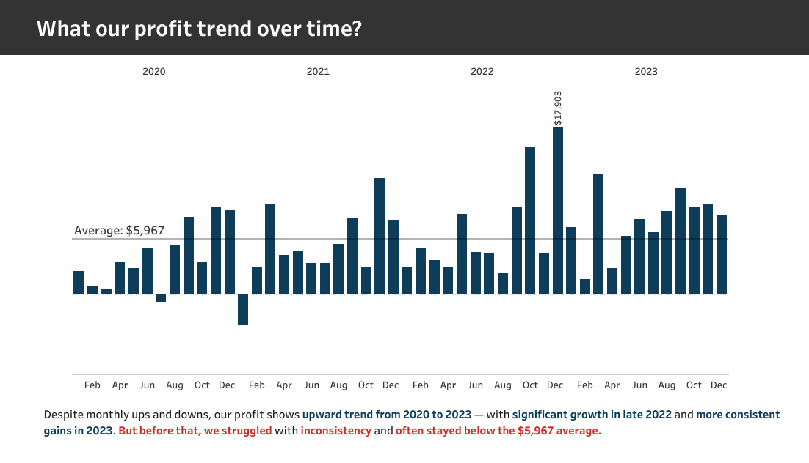
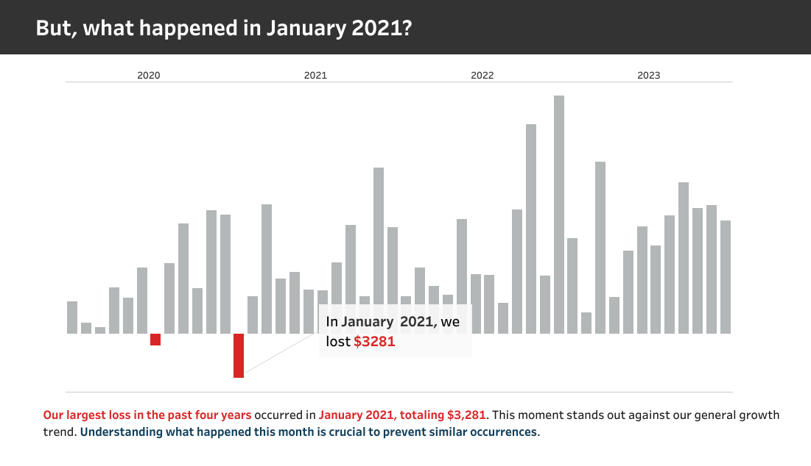
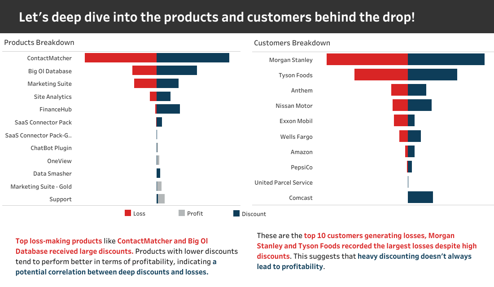
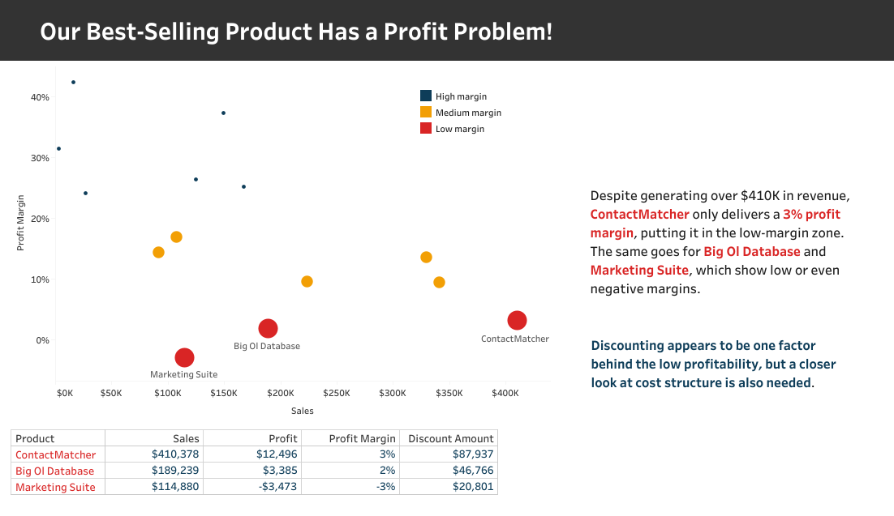
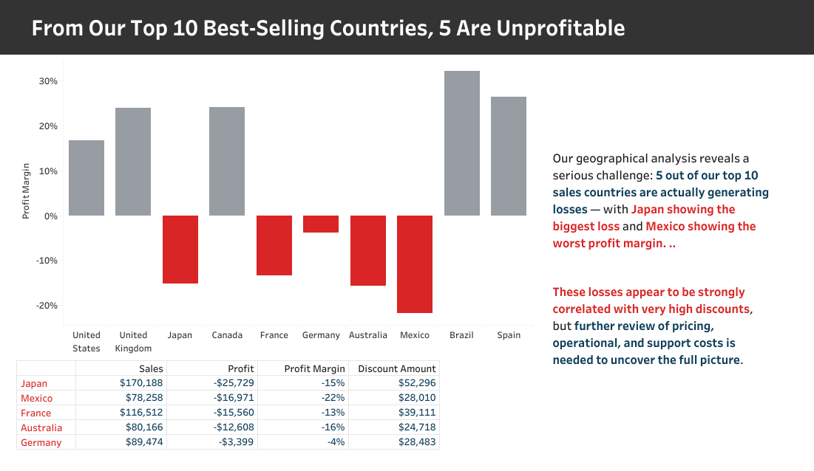

# SaaS AWS Profitability Analysis: A Deep Dive

## 1. Project Background
This comprehensive project combines an interactive dashboard and deep-dive analysis of Software-as-a-Service (SaaS) profitability on AWS, using a simulated dataset sourced from Kaggle. The primary goal is to optimize product and customer strategies to consistently improve profit margins through data-driven insights. This analysis covers profitability trends over time (2020-2023), identifies critical profit drops, analyzes product and customer performance, and provides actionable recommendations for business optimization.

The project addresses the fundamental question: "How can we optimize our product and customer strategies to consistently improve profit margins?" Through detailed visualization and analysis, we uncover patterns, identify problem areas, and provide strategic recommendations for sustainable growth.

## 2. Executive Summary
This profitability analysis reveals an upward profit trend from 2020 to 2023, with significant growth observed in late 2022 and consistent gains in 2023. However, the business experienced inconsistency and struggled to stay above the average profit of $5,967 in earlier periods. A notable loss of $3,281 occurred in January 2021, primarily driven by large discounts on products like ContactMatcher and Big OI Database, and significant losses from key customers such as Morgan Stanley and Tyson Foods. Furthermore, while some products are best-sellers, they exhibit low profit margins (e.g., ContactMatcher with 3% profit margin). Geographically, 5 out of the top 10 best-selling countries are unprofitable, with Japan showing the largest loss and Mexico the worst profit margin, largely due to high discounts. This report provides recommendations to address these challenges and optimize profitability.

## 3. Insights

*   **Profit Trend Over Time:** While the overall trend from 2020 to 2023 is upward, there was significant inconsistency, particularly before late 2022. The average monthly profit was $5,967, but many months fell below this, indicating a need for more stable growth.

*   **January 2021 Profit Drop:** A significant loss of $3,281 was recorded in January 2021. This was a critical event that stands out against the general growth trend. A deep dive into this period revealed that top loss-making products like `ContactMatcher` and `Big OI Database` received large discounts. Similarly, key customers such as `Morgan Stanley` and `Tyson Foods` recorded the largest losses despite high discounts, suggesting that heavy discounting does not always lead to profitability.

*   **Best-Selling Product Profit Problem:** Our best-selling product, `ContactMatcher`, despite generating over $410K in revenue, only delivers a 3% profit margin, placing it in the low-margin zone. `Big OI Database` and `Marketing Suite` also show low or even negative margins. This indicates that discounting is a significant factor impacting profitability, and a closer look at the cost structure is also necessary.

*   **Unprofitable Countries:** A geographical analysis shows a serious challenge: 5 out of our top 10 sales countries are actually generating losses. Japan shows the biggest loss, and Mexico has the worst profit margin. These losses appear to be strongly correlated with very high discounts, but further review of pricing, operational, and support costs is needed to understand the full picture.

## 4. Recommendations

To optimize profitability and address the identified challenges, the following recommendations are proposed:

1.  **Optimize Discounting Strategy:** Implement a strategic discounting approach, especially for high-volume products like `ContactMatcher`. Explore alternative promotional tactics beyond discounts, such as loyalty programs, to drive sales and profitability.
2.  **Enhance Customer Profitability:** Re-assess key customer profitability through Quarterly Business Reviews (QBRs). Focus on upselling higher-margin products or renegotiating contracts to reduce excessive discounts and improve overall customer value.
3.  **Refine International Market Approach:** We need to look closely at how we do business in countries where we are losing money. Reduce aggressive discounting and prioritize product value proposition to achieve organic growth and sustainable profitability in these regions.
4.  **Prioritize High-Margin Products:** Shift sales and marketing efforts towards products with proven high-profit margins. Develop and leverage success stories from these products to attract new customers and maximize overall profitability.

## 5. Links

Explore the full interactive experience and detailed analysis directly on Tableau Public:
Interactive Dashboard: [https://public.tableau.com/views/SaaSAWSProfitabilityDashboard/DashboardFinal?:language=en-US&:sid=&:redirect=auth&:display_count=n&:origin=viz_share_link]
Interactive Slides: [https://public.tableau.com/views/SaaSInsightsPresentation/SaaSAWSProfitabilityAnalysis2?:language=en-US&:sid=&:redirect=auth&:display_count=n&:origin=viz_share_link]

Dataset Source: [https://www.kaggle.com/datasets/nnthanh101/aws-saas-sales]

